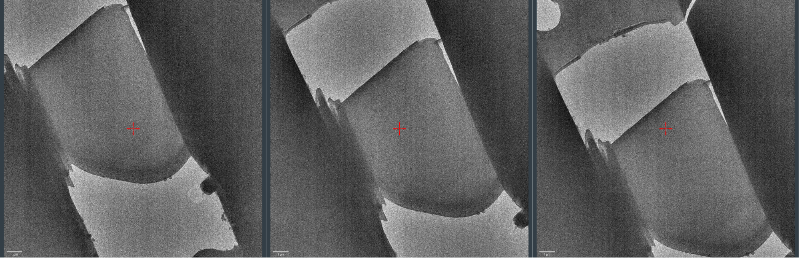
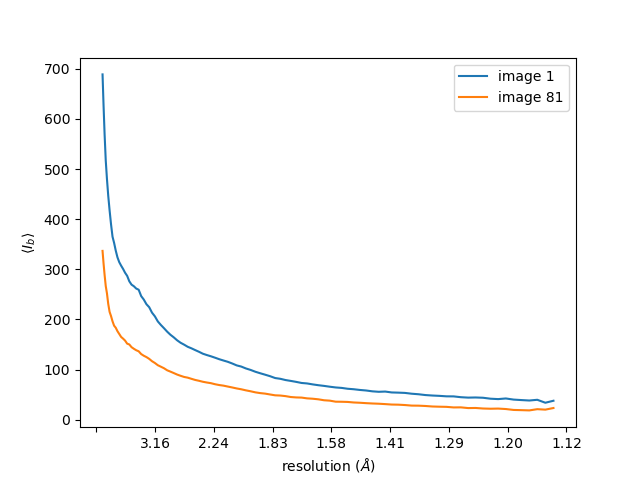
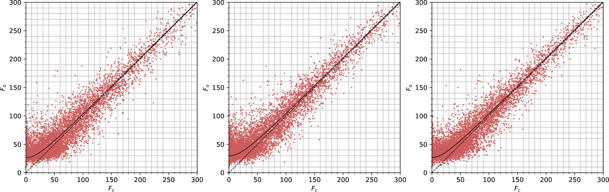
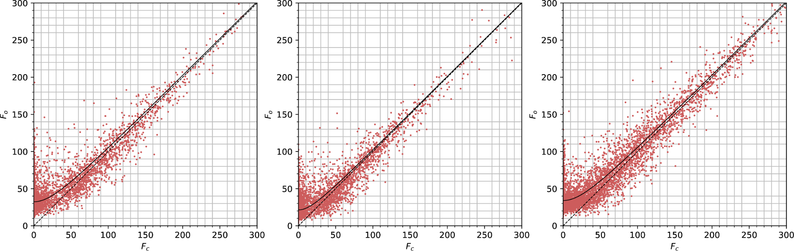
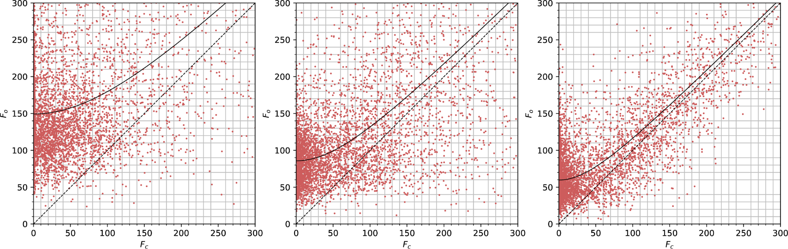
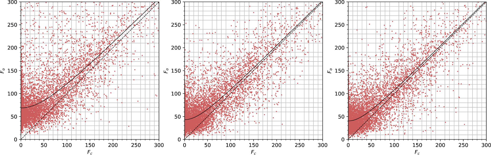
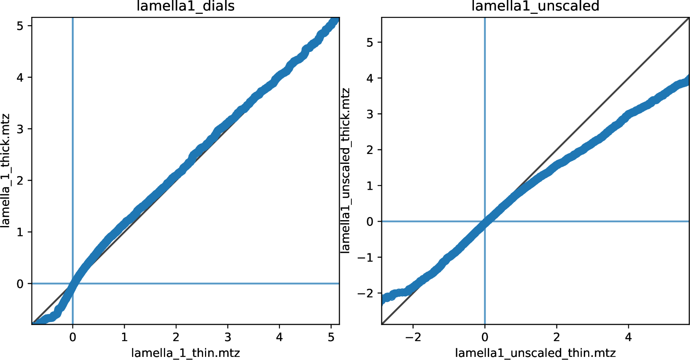
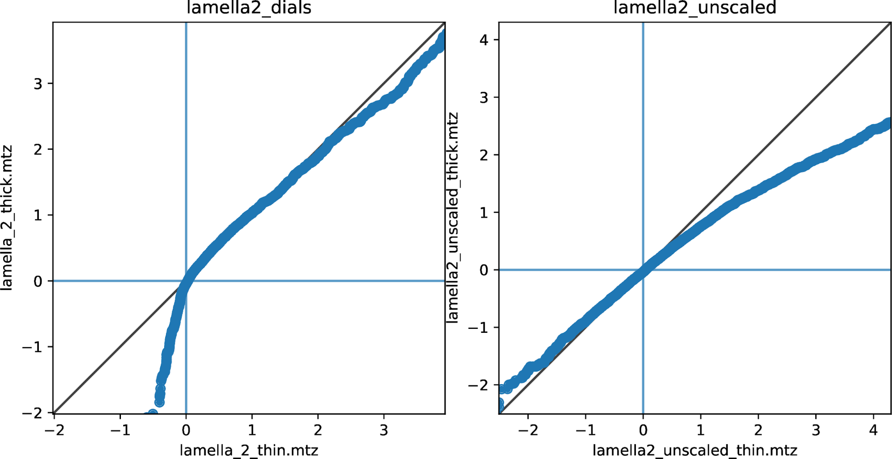
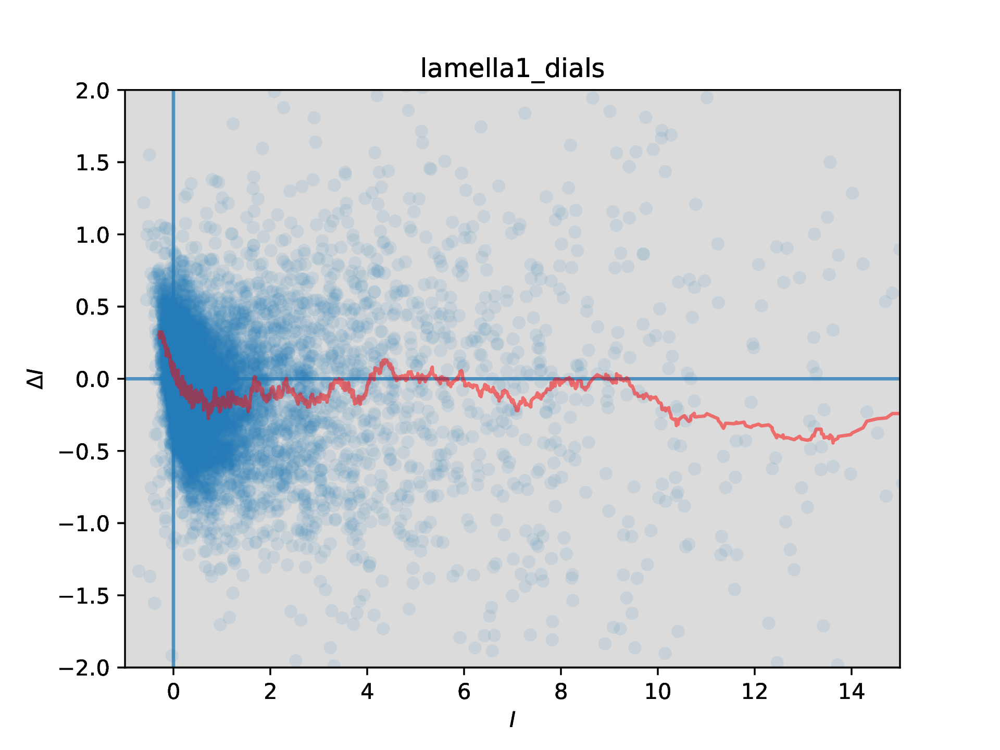

<h2>Wedged lamellae</h2>

<h3>The effects of crystal thickness on electron diffraction intensities</h3>

David Waterman, December 2020 - May 2021

<h2>Data</h2>

Emma Beale collected 9 datasets from three positions each on three proteinase K crystals, which she had cut by focussed ion beam milling into wedge shapes. These datasets give us a very interesting opportunity to investigate the effect of crystal thickness on diffraction intensities, keeping other parameters (including crystal orientation) the same.

These datasets are available for download from <a href="https://zenodo.org/record/4282541">https://zenodo.org/record/4282541</a>. Instructions for processing the data with DIALS, plus generating all plots in this document, are available at <a href="https://github.com/dagewa/wedged-lamellae">https://github.com/dagewa/wedged-lamellae</a>.

<h3>Lamella 1</h3>

The positions of each data collection on the crystal wedge shown from "thick" (left) to "thin" (right).

<h3>Lamella 2</h3>

The positions of each data collection on the crystal wedge shown from "thick" (left) to "thin" (right).

<h3>Lamella 3</h3>

The positions of each data collection on the crystal wedge shown from "thick" (left) to "thin" (right).

<h2>Processing with DIALS</h2>

The current version of the <code>process.sh</code> script integrates each dataset, ensuring that the <code>sigma_b</code> and <code>sigma_m</code> shoebox parameters are set to the same for each position within a single crystal. There is negative bias present these images from the Ceta D detector, so a pedestal was added to each image before processing. 

The level of bias can be investigated for a dataset using

<pre class="prettyprint">dials.show imported.expt image_statistics.show_raw=True
</pre>

which prints a five number summary of the pixel counts in each image. Using that, for example, I see that for the lamella 1 thick dataset, the final image (81) has the lowest median value (63 raw ADUs). I can plot the background for the first and last image of that dataset like this

<pre class="prettyprint">dials.background imported.expt images=1,81 d_max=10 plot=background.png
</pre>

The blue line shows average background on the first image, the orange line on the last image. Previous versions of this plot used an earlier version of <code>dials.background</code>, which did not take into account masked regions properly. The average background appears to fall during data collection, but does not become negative. This makes sense, as the median value of the background is always positive. This also explains why changing the pedestal (below) does not cause failures in integration. The failures occur when the mean background is negative (<a href="https://github.com/dials/dials/issues/1732">https://github.com/dials/dials/issues/1732</a>)

For the purposes of integration, we are interested in the reflections in, let's say, the range 10--2.0 Å. The average background for each image can be obtained by

<pre class="prettyprint">dials.background d_max=10 d_min=2 imported.expt | grep "Mean background"
</pre>

Plotting these values:

For further analysis of these data sets, I started by looking at pedestals around 100 counts (this is also similar to the bias of 128 suggested by the Gonen group for Ceta-D in <a href="https://journals.iucr.org/m/issues/2019/05/00/fq5007/">https://journals.iucr.org/m/issues/2019/05/00/fq5007/</a>). This gives a five-number summary for the <em>corrected</em> image values on the last image as:

<pre class="prettyprint">image_081.mrc: Min: -13.3 Q1: 4.9 Med: 6.3 Q3: 7.9 Max: 155.0
</pre>

(<code>dials.show imported.expt image_statistics.show_corrected=</code>True)

It is not clear that a pedestal of -100 is optimum - in fact for datasets like this where the mean background values are not negative, a pedestal of 0 is surely preferable.

<h3>Optimising the pedestal - wide range</h3>

Why does the pedestal level change CC1/2? How much does it change? To try to answer these questions I integrated every dataset with different pedestal settings from 0 to -230 in steps of -10 (the pedestal is <em>subtracted</em> from the images, so these values correspond to addition of 0 to +230 raw ADUs to the image arrays). I then scaled the datasets for each crystal at each pedestal point. For example, for a pedestal of -100 for lamella 1, I scaled the thick, mid and thin datasets together. This produces an overall dataset with overall multiplicity > 13 (but completeness is 60% because each thickness dataset samples the same 37.5° tilt).

With these datasets I could compare the curves of CC1/2 vs resolution. With so many pedestal levels these "spaghetti plots" are hard to interpret, but at least show to what extent the CC1/2 varies due to the pedestal. In an attempt to extract more useful information from these plots I also calculated the weighted average CC1/2 across the resolution bins to get an overall average CC1/2 value for each pedestal level. This method of calculating overall CC1/2 is inspired by the comment at the end of section 2.3 in Assmann, G., Brehm, W., & Diederichs, K. (2016). Identification of rogue datasets in serial crystallography. <em>Journal of Applied Crystallography</em>, <em>49</em>, 1021–1028. <a href="https://doi.org/10.1107/S1600576716005471">https://doi.org/10.1107/S1600576716005471</a>.

The results show a tendency for the average CC1/2 to fall as the absolute magnitude of the pedestal increases. That is, the "best" dataset by this measure is close to a pedestal of zero. However, it is worth noting that the number of reflections included by dials.scale also changes with pedestal and generally has the opposite trend: low magnitude pedestals result in fewer reflections, so although they have higher CC1/2 they might not be optimal, because slightly fewer reflections are included.

<h4>Lamella 1</h4>

<h4>Lamella 2</h4>

<h4>Lamella 3</h4>

Why are there fewer reflections for lower magnitude pedestals? Is it from spot-finding, indexing, integration, or scaling? It seems to be a combination of factors. Comparing the reflection flags between the <code>pedestal=-50</code> and <code>-150</code> dataset for each lamella I see

<pre class="prettyprint">    Lamella 3
                                -50      -150        diff
    indexed:                    8560     7628        932    
    integrated:                 191572   191766     -194  
    mn intensity.sum.variance:  9967.0   14745.6    -4778.6  
    bad_for_scaling:            80660    80545       115  
    scaled:                     127248   127581     -333  

    Lamella 2                                      
                                -50      -150        diff
    indexed:                    3910     3305        605
    integrated:                 179974   180256     -282
    mn intensity.sum.variance:  11398.2  19231.8    -7833.6
    bad_for_scaling:            111874   111636      238
    scaled:                     82245    82786      -541

    Lamella 1                                       
                                -50      -150        diff
    indexed:                    8273     8039        234  
    integrated:                 188776   188920     -144  
    mn intensity.sum.variance:  10692.6  15850.3    -5157.7  
    bad_for_scaling:            56733    56350       383
    scaled:                     148506   149067     -561
</pre>

<ul>

<li>In each case there are more indexed reflections at -50. Probably because more strong spots are found with the lower magnitude pedestal

<li>There is a small number fewer reflections integrated at -50 (biggest difference for lamella 2). This appears to be a result of the different number of indexed reflections rather than an increase in rejections from integration (see below).

<li>There are a few hundred reflections more marked <code>bad_for_scaling</code> at -50

<li>The number of scaled reflections is a bit less at pedestal -50. This reduction is close to the reduction due to fewer integrated reflections plus the reduction due to reflections being marked <code>bad_for_scaling</code>.
</li>
</ul>

There is not one simple explanation for the difference in number of reflections processed at different pedestal levels. The major difference in the datasets are the estimated intensity errors. The mean summation integration intensity variance at -150 is about 1.5 times higher than the mean variance at -50. The difference in number of processed reflections seems to be a composite effect based on how the error estimates interact with various stages in the processing pipeline. 

<h3>Optimising the pedestal - narrow range</h3>

Following Takanori's suggestion, I ran the pedestal script again, but this time having the pedestal only affect integration (and thus also scaling). This was achieved by skipping the spot finding step, which instead was replaced by copying the <code>strong.refl</code> file from a previous run with a pedestal of 0. There were 9 different <code>strong.refl</code> files used in total, which came from previous run directories <code>lamella_{1,2,3}_{thick,mid,thin}_0/</code>. After a few times trying this procedure I found that the region of interest is around low <code>|pedestal| </code>values, so I homed in on the region from 0 to -30. The new plots are as follows

<h4>Lamella 1</h4>

<h4>Lamella 2</h4>

<h4>Lamella 3</h4>

Interestingly, the same set of reflections were integrated each time. For example, for <code>integrated.refl</code> datasets in <code>lamella_1_thick_*</code> (<code>0</code> to <code>-30</code>), the number of reflections with the <code>integrated</code> flag was always 63594. That is, the choice of pedestal does not affect the reflections that are actually integrated. In other words, reflections are not rejected from integration because of the pedestal level. The flags only start to differ after scaling, with an increasing number of <code>bad_for_scaling</code> reflections as the pedestal increases towards 0. 

This indicates that the difference in the number of processed reflections is <em>down to scaling</em>. As the pedestal value becomes more negative, more reflections are accepted for scaling, but the CC1/2 tends to get worse. This is most obvious with lamella 1.

It is difficult to extract the best pedestal from these results. There does appear to be some structure in the average CC1/2 plots, but there is a lot of noise. With lamella 1 this is very clear as the peak of CC1/2, at <code>pedestal=-16</code>, is right next to the lowest value of CC1/2 at <code>pedestal=-14</code>.

But now it appears that a pedestal close to 0 might be best. Note that in each case above the pedestal at zero does not give the best CC1/2, this is always achieved at a small value like -10 or -20. It might be useful to repeat the pedestal analysis again, but in smaller steps from 0 to -30.

<h3>Processing for analysis at different thicknesses</h3>

<del>Exploration using the data for lamella 3 led to selecting +100 raw ADUs as a suitable pedestal, as this maximised outer shell CC1/2</del>. The analysis above shows that a pedestal of -100 (i.e. +100 raw ADUs) is not necessarily optimal. At the moment though, further processing and analysis was done with pedestal=-100 (+100 raw counts) for each lamella.

The datasets for each lamella were then scaled, with data combined across each position. After scaling, the datasets were split again and merged separately, so that the different positions (thick to thin) can be compared. The intention here is to use scaling to remove whatever sample-dependent effects it can already handle, so that any systematic difference remaining due to thickness is left visible. This may indicate what parameters should be explored to improve scaling algorithms.

Data quality varies between the lamellae. The resolution limit has been selected so that CC1/2 ~ 0.3 in the outer shell (this process should be repeated once a final pedestal level has been chosen). The resolution limits are currently set as:

<table>
  <tr>
   <td>Lamella 1
   </td>
   <td>2.0 Å
   </td>
  </tr>
  <tr>
   <td>Lamella 2
   </td>
   <td>2.4 Å
   </td>
  </tr>
  <tr>
   <td>Lamella 3
   </td>
   <td>2.1 Å
   </td>
  </tr>
</table>

<h2><em>Fo</em> vs <em>Fc</em> plots</h2>

The first way I tried to investigate the effect of crystal thickness on the "corruption" of intensities caused by multiple scattering and other processes was to compare the calculated structure factors with the observed structure factors for datasets at different thicknesses. Because I scaled all the data for each thickness together, but then split into three datasets (thick, mid and thin) before merging, the differences between the plots should tell us something about thickness-dependent effects that currently escape correction by the scaling algorithm.

To produce these plots we need a structural model. I took <a href="https://www.rcsb.org/structure/6ZEU">6zeu.cif</a> from the PDB and refined this model vs each dataset for 30 cycles in Refmac to get the calculated structure factors, using <code>SOURCE ELECTRON MB</code> to get electron scattering form factors. Observed structure factors come from the merged intensities within each thickness, truncated according to the French & Wilson algorithm by ctruncate.

<h3>Lamella 1</h3>

Observed vs calculated structure factors for lamella 1 at the thick (left), mid (centre) and thin (right) positions, for data scaled by dials.scale.

The plot above shows a deviation of <em>Fo</em> from <em>Fc</em> for weak reflections at each thickness. Previous work [Clabbers, M. T. B., Gruene, T., van Genderen, E., & Abrahams, J. P. (2019). Reducing dynamical electron scattering reveals hydrogen atoms. Acta Crystallographica Section A Foundations and Advances, 75(1), 1–12. <a href="https://doi.org/10.1107/S2053273318013918">https://doi.org/10.1107/S2053273318013918</a>] suggested that the intercept of a hyperbolic fit line through the Y axis, |<em>Fe</em>|, could be used to assess the degree of dynamic scattering for a dataset. If that is the case, we expect to see a greater |<em>Fe</em>| term for the thicker crystal position compared with the thinner.

For lamella 1, we don't see that effect with the dials.scale data.

<table>
  <tr>
   <td>Thick
   </td>
   <td>|<em>Fe</em>| = 26.3
   </td>
  </tr>
  <tr>
   <td>Mid
   </td>
   <td>|<em>Fe</em>| = 29.6
   </td>
  </tr>
  <tr>
   <td>Thin
   </td>
   <td>|<em>Fe</em>| = 26.7
   </td>
  </tr>
</table>

The value for the "mid" thickness is highest, but I don't know if the differences are actually significant as I don't have an error calculation on |<em>Fe</em>|.

It is possible that the data scaling algorithm affects the results. To explore that I also did the scaling using aimless rather than dials.scale and repeated the analysis.

Observed vs calculated structure factors for lamella 1 at the thick (left), mid (centre) and thin (right) positions, for data scaled by aimless.

It is clear that the scaling program affects these plots significantly! There is a much greater scatter around the curve for the aimless data than for the dials.scale data. The |<em>Fe</em>| error terms are also higher magnitude, and now the mid dataset actually has the lowest value (but differences might be within uncertainty).

<table>
  <tr>
   <td>Thick
   </td>
   <td>|<em>Fe</em>| = 38.5
   </td>
  </tr>
  <tr>
   <td>Mid
   </td>
   <td>|<em>Fe</em>| = 37.5
   </td>
  </tr>
  <tr>
   <td>Thin
   </td>
   <td>|<em>Fe</em>| = 37.8
   </td>
  </tr>
</table>

<h3>Lamella 2</h3>

What is the situation for the second lamella - the crystal with worst merging statistics?

Observed vs calculated structure factors for lamella 2 at the thick (left), mid (centre) and thin (right) positions, for data scaled by dials.scale.

Observed vs calculated structure factors for lamella 2 at the thick (left), mid (centre) and thin (right) positions, for data scaled by aimless.

<table>
  <tr>
   <td>
   </td>
   <td>dials.scale
   </td>
   <td>aimless
   </td>
  </tr>
  <tr>
   <td>Thick
   </td>
   <td>|<em>Fe</em>| = 32.3
   </td>
   <td>|<em>Fe</em>| = 149.3
   </td>
  </tr>
  <tr>
   <td>Mid
   </td>
   <td>|<em>Fe</em>| = 21.4
   </td>
   <td>|<em>Fe</em>| = 85.7
   </td>
  </tr>
  <tr>
   <td>Thin
   </td>
   <td>|<em>Fe</em>| = 34.0
   </td>
   <td>|<em>Fe</em>| = 59.6
   </td>
  </tr>
</table>

The plots for data from dials.scale vs aimless are again very different, and the intercept |<em>Fe</em>| does not even change in the same direction as we go from thick to thin. The aimless values go in the direction we expect, with thin &lt; mid &lt; thick, but for dials.scale the order is mid &lt; thick &lt; thin.

<h3>Lamella 3</h3>

Observed vs calculated structure factors for lamella 3 at the thick (left), mid (centre) and thin (right) positions, for data scaled by dials.scale.

Observed vs calculated structure factors for lamella 3 at the thick (left), mid (centre) and thin (right) positions, for data scaled by aimless.

<table>
  <tr>
   <td>
   </td>
   <td>dials.scale
   </td>
   <td>aimless
   </td>
  </tr>
  <tr>
   <td>Thick
   </td>
   <td>|<em>Fe</em>| = 39.1
   </td>
   <td>|<em>Fe</em>| = 68.7
   </td>
  </tr>
  <tr>
   <td>Mid
   </td>
   <td>|<em>Fe</em>| = 28.7
   </td>
   <td>|<em>Fe</em>| = 43.1
   </td>
  </tr>
  <tr>
   <td>Thin
   </td>
   <td>|<em>Fe</em>| = 24.2
   </td>
   <td>|<em>Fe</em>| = 40.3
   </td>
  </tr>
</table>

At least this time the ordering of thin &lt; mid &lt; thick is true for both dials.scale and aimless dataset, even if the magnitudes are different.

<h3>Summary</h3>

<em>Fo</em> vs <em>Fc</em> plots are not an ideal diagnostic tool for intensity differences due to dynamic diffraction. There are various reasons for this. One is that they depend on multiple steps downstream of intensity measurement. We don't use the intensities directly, but truncate to get <em>F</em>s. That alone is problematic as weak reflections are biased. Also, the |<em>Fc</em>| values are dependent on model refinement. We can start with the same model for each dataset, but the refinement history will differ in each case and we can no longer assume the differences in the plots are purely due to differences in the datasets. (though it would probably be better to refine a model once against the combined dataset, then do 0 cyc refinement against the data for each position to generate <em>Fc</em> for the same model in each case).

Another issue is that the scaling program apparently affects the plots a great deal. It is not surprising that scaling, <em>which is part of the intensity observation process</em>, affects the plots, however it is disappointing that trends between the different thicknesses are not preserved. This implies the differences between datasets are too subtle to suggest a single correction type that "bolts on" to all existing scaling algorithms.

<h2>Q-Q plots</h2>

In addition to the previously-mentioned flaws with <em>Fo</em> vs <em>Fc</em> plots, the thesis that |<em>Fe</em>| can be used to assess the degree of dynamic diffraction may not hold, because non-zero |<em>Fe</em>| values are quite commonly also seen with X-ray diffraction datasets, where multiple scattering is minimal (would be nice to have an example to look at). It could be the case that bias from integration, or introduced during the truncate procedure, or at any other stage in the steps towards obtaining <em>Fo</em> values, might dominate |<em>Fe</em>| and the plots may say very little at all about dynamic diffraction.

Back in February, Garib suggested using Q-Q plots instead. Some reasons are:

<ul>

<li>There is no model curve to fit - it is a comparison of one dataset against another

<li>The intensities can be used directly, not <em>Fo</em>s, so there is no truncation bias

<li>We don't need a structural model to calculate <em>Fc</em>s
</li>
</ul>

The Q-Q plot is just an ordered plot of the intensities in one dataset versus another. Because the datasets at each position have very similar crystal orientations, the set of measured reflections are very similar. Nevertheless, this is strictly enforced in the plotting script used, by ensuring only the common set of reflections is included. Here we compare the thin and thick datasets, as we expect the biggest difference between these two.

Previously we saw very little difference between scaling by DIALS and scaling by Aimless for these plots, so I have since removed the scaling by aimless and look at the DIALS scaling only. In addition, I have simplified the scaling model according to James Beilsten Edmands suggestion (<code>physical.decay_correction=False physical.absorption_correction=False</code>) to remove resolution-dependent factors. What remains is the overall tilt-dependent scale factor.

<h3>Lamella 1</h3>

Q-Q plots of reflection intensities for lamella 1, comparing the thin crystal position (horizontal axis) with the thick position (vertical axis), with data scaled by dials.scale (left) and unscaled reflections (right).

For lamella 1, the scaled dataset doesn't show much difference between thick and thin on these plots, apart from a deviation at very low intensity (I&lt;0). It's important to note that the data for thin, mid and thick positions were all scaled together and then split before merging. So thin and thick were present in the same scaling procedure. The unscaled intensities <em>do</em> show a difference between datasets, but it cannot be proved that this is due to a thickness-dependent physical effect. The thick dataset does appear to have slightly raised weak intensities and reduced strong intensities, which fits our expectations of the effect due to increased multiple scattering.

<h3>Lamella 2</h3>

Q-Q plots of reflection intensities for lamella 2, comparing the thin crystal position (horizontal axis) with the thick position (vertical axis), with data scaled by dials.scale (left) and unscaled reflections (right).

For the second lamella the difference between the thin and thick datasets after scaling is clearer. Again, the very weak (i.e. negative) intensities deviate from the y=x line such that the thin crystal intensities are <em>higher</em> than thick crystal intensities in the same quantile. This is the opposite than what we expect from a multiple-scattering model. However, it may be worth noting that these negative-valued reflections would not be used to refine the scaling model, as there is some positive I/sigI cutoff for inclusion in the working set of reflections. The scaling model minimises the differences between merging groups of more intense reflections. Could the deviation of negative-valued reflections be a side-effect? The scaling model appears not to correct for all differences between the datasets for the higher intensity reflections though, as the line deviates here as well. The thick dataset appears to have slightly reduced magnitude strong reflections in a way that even survives the scaling procedure.

The plot for the unscaled data is somewhat similar to the one for lamella 1. There is a slight raise in intensity of the lowest valued (most negative) reflections for the thick dataset, and a more marked reduction in the intensity of the strongest reflections for the thick dataset than the scaled datasets show.

<h3>Lamella 3</h3>

Q-Q plots of reflection intensities for lamella 3, comparing the thin crystal position (horizontal axis) with the thick position (vertical axis), with data scaled by dials.scale (left) and unscaled reflections (right).

For lamella 3, the scaled data plot again shows a clear deviation for the weakest (most negative) intensities, so that the thick part of the crystal has lower (more negative) intensity than the thin part. Again, this <em>could</em> be an artifact of the scaling procedure, which does not use these reflections to form a model. No clear deviation is present for the stronger reflections.

For the unscaled data, there is little difference between thick and thin for the weakest (negative) reflections, but the strong reflections show the same deviation as before, with reduced intensity for the reflections from the thick dataset.

<h2>ΔI vs I plots</h2>

For each lamella, the datasets at each position have the same orientation. Therefore the same set of reflections are recorded each time (apart from a few differences due to edge effects). This means we can match intensities between datasets for more specific comparison.

Scaling results show that the thin crystal datasets have greater intensity than the thick crystal dataset (for thick crystals, perhaps more signal is lost to the background noise?). Define ΔIhkl = Ihkl,thin - Ihkl,thick, and now look at how this varies with intensity (there appears to be no variation with resolution - will add those graphs soon)

<h3>Lamella 1</h3>

ΔI vs I plot for the difference between the thin and thick datasets for lamella 1, after scaling using a simple tilt-dependent model to correct for overall scale difference only. A moving average line (with a window size of 100 points) has been added to aid interpretation

<h3>Lamella 2</h3>

<h3>Lamella 3</h3>

<h2>Next steps</h2>

Investigate resolution-dependent features:

Looking for the optimum pedestal judging by data processing statistics seems tricky. It may be necessary and preferable to perform model refinement against each dataset and judge the best pedestal by refinement results. Completeness is low however (~60%), so this might require Rcomplete calculation at each pedestal level. See notes and script from Tim Gruene about calculating Rcomplete. As there are many datasets, this should be done on a compute cluster.

I don't yet understand what the <em>Fo</em> vs <em>Fc</em> or Q-Q plots are telling me regarding a thickness-dependent effect on the intensities in electron diffraction experiments. 

The ΔI vs I plots are intriguing and suggestive of a systematic effect, but interpretation is not yet clear.

I would be happy to hear of any other suggestions, or interpretation of the results so far!

